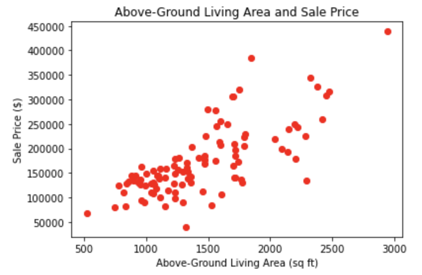
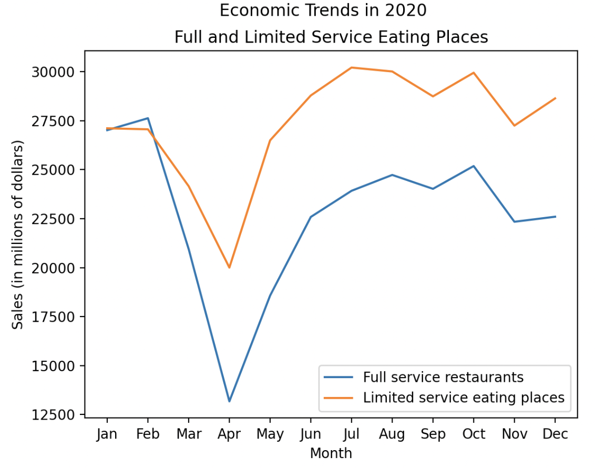
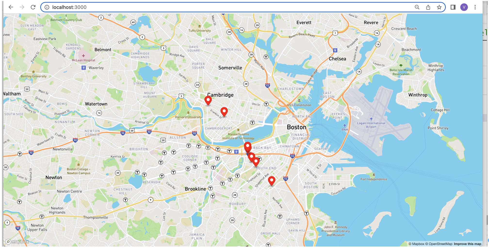

<!-- doctype html -->
<!-- <html lang="en">
  <head>
    <meta charset="utf-8">
    <meta name="viewport" content="width=device-width, initial-scale=1">
    <title>Bootstrap demo</title>
  </head>
  <body>
    <h1>Hello, Virginia!</h1>
  </body>
</html> -->

<!-- # ogozalek.github.io -->
<h1>Virginia Ogozalek</h1>
<table>
  <tr>
    <td></td>
    <td><i>I program my home computer, beam myself into the future.</i> 
    &nbsp;&nbsp;&nbsp;&nbsp;&nbsp;&nbsp;&nbsp;&nbsp;&nbsp;&nbsp;&nbsp; &nbsp;&nbsp;&nbsp;&nbsp;&nbsp;&nbsp;&nbsp;&nbsp;&nbsp;&nbsp;&nbsp;&nbsp;&nbsp;&nbsp;&nbsp;&nbsp;&nbsp;&nbsp;&nbsp;&nbsp;&nbsp;&nbsp;- Kraftwerk, <i>Computer World</i> 
       
      20+ years of programming experience, with an interlude  
      of going to the woods to build houses.
      </td>
  </tr>
</table>
<b>Education:</b> &#x2022; MIT xPRO Certificate in Data Engineering (2023) &#x2022; Harvard University - ALM Studio Arts, Film & Photogaphy (2002) &#x2022; Northeastern University - PhD Law & Public Policy (1992) &#x2022; WPI - MS Computer Science (1985) &#x2022; Colby College - BA Psychology (1976)  
<b>Technical Skills:</b> &#x2022; Python &#x2022; SQL &#x2022; Excel &#x2022; macOS &#x2022; Windows 11 &#x2022; JavaScript &#x2022; Docker &#x2022; Postman &#x2022; Flask &#x2022; Bootstrap &#x2022; MySQL
&#x2022; Mongo DB &#x2022; Redis &#x2022; Cassandra &#x2022; Firebase &#x2022; Java &#x2022; Debezium &#x2022; Mapbox &#x2022; Maven &#x2022; NiFi &#x2022; Hadoop &#x2022; Spark &#x2022; Airflow &#x2022; ThingsBoard
&#x2022; Mosquitto &#x2022; Kafka &#x2022; Predictive Machine Learning &#x2022; Artifical Intellegence &#x2022; Deep Neural Networks &#x2022; Agile Development &#x2022; SPSS 
&#x2022; C &#x2022; HTML &#x2022; Lisp &#x2022; COBOL &#x2022; FORTRAN &#x2022; IBM 360 Assembly Language (BAL) 
<b>Projects</b>
<table>
  <tr valign="TOP">
    <td><a href="https://github.com/ogozalek/Predict_Housing_Prices">Building a Model to Predict Housing Prices </a> 
       
    Use multiple linear regression to predict housing prices.
    </td>
    <td><a href="https://github.com/ogozalek/Covid19_and_Retail_Sales">Exploring Effects of the COVID-19 Lockdowns on Retail Sales </a> 
      
      Use ETL to analyze the Monthly Retail Trade Survey (MRTS).
      </td>
    <td><a href="https://github.com/ogozalek/Transit_Application">Building a Transit Data Application </a> 
     
      Use API for Boston's MBTA system.
    </td>
  </tr>
  </table>
 
  <table>
    <tr valign="TOP">
    <td><a href="https://github.com/ogozalek/Transit_Application">Building a Transit Data Application </a> 
     
      This project uses the API for Boston's MBTA system to display the position of buses on a map on a website. 
     
    Tech Stack: Python (pandas, matplotlib, haversine), MySQL, Flask, HTML, JSON, Docker, Maven Springboot, Debezium, CDC, nano, MongoDB, javamaven 
    </td>
    <td><a href="https://github.com/ogozalek/Netflix_World_Traveler/blob/main/README.md">Netflix World Traveler</a>* 
       
      This project analyzes my Netflix <i>ViewingActivity.csv</i> file to track international TV series I've watched. 
     
    Tech Stack: Python, CSV file processing, HTML, Flask, machine learning 
    * This is a personal project for educational purposes only.
    </td>
  </tr>
</table>

<table>
    <tr valign="TOP">
    <td><a href="https://github.com/ogozalek/Canadian_Wildfires">Canadian Wildfires Air Quality Sensor Alarm </a> 
     
      This IoT project uses Mosquitto and ThingsBoard with a PurpleAir AQI sensor to sound an alarm when smoke from the Canadian wildfires makes the air outside dangerous to breathe. 
     
    Tech Stack: Mosquitto mqtt, Docker, ThingsBoard, Python, Telegram bots 
    </td>
     <td>TK 
    </td>
  </tr>
</table>

Creating a Books Web Application 
Creating a Sensemaking Data Pipeline 
Analyzing Live Streaming Data Using ThingsBoard 
* not for final version: <a href="https://github.com/ogozalek/PCDE-Activity-9.1">Repository for Activities 9.1 and 9.2 </a> 
