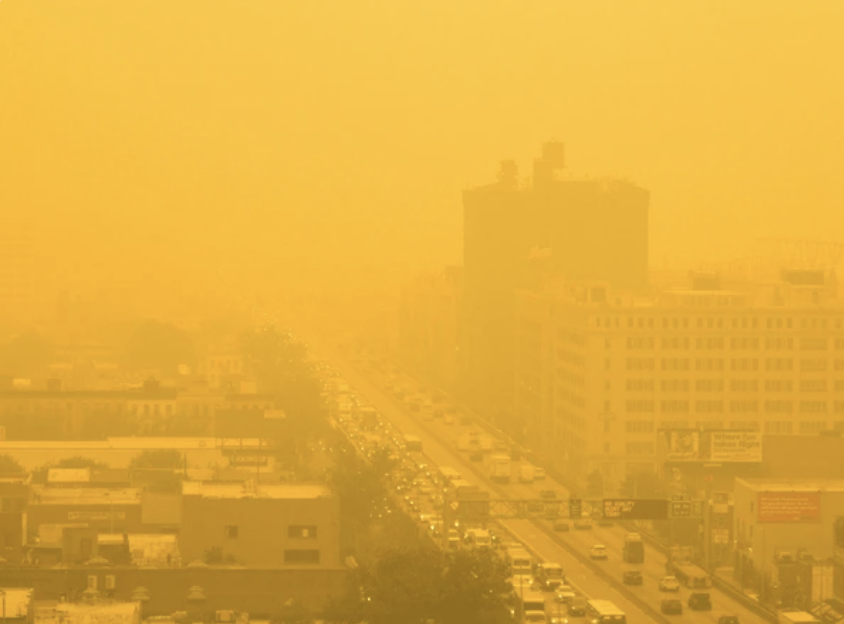

<!DOCTYPE html>
<html>

<head>
  <title>ogozalek.github.io</title>
  <link rel="stylesheet" type="text/css" href="resources/css/reset.css">
  <link rel="stylesheet" type="text/css" href="resources/css/style.css">
</head>

<body>
  

    <nav class="container">
      <ul>
        <li>Something</li>
        <li>Something</li>
        <li>Contact Me</li>
      </ul>
    </nav>
    <!--  -->
  

  

    
    

      <h1>Virginia Ogozalek</h1>
      
20+ years of coding experience

      
Master's Degree in Computer Science

      
MIT xPRO Certificate in Data Engineering

    

  

<!--
  
  
      
<h2>Technical Skills</h2> Python &#x2022; SQL &#x2022; Excel &#x2022; macOS &#x2022; Windows 11 &#x2022; JavaScript &#x2022; Docker &#x2022; Flask
        &#x2022; Mongo DB &#x2022; Redis &#x2022; Cassandra &#x2022; Firebase &#x2022; Mapbox &#x2022; Hadoop &#x2022; Spark &#x2022; Airflow &#x2022; ThingsBoard
        &#x2022; Mosquitto &#x2022; Kafka &#x2022; SPSS 
        &#x2022; C &#x2022; HTML &#x2022; Lisp &#x2022; COBOL &#x2022; FORTRAN &#x2022; IBM 360 Assembly Language (BAL)
 
  

-->
  

    <h2>Technical Skills</h2>
  

  

    
Python &#x2022; SQL &#x2022; Excel &#x2022; macOS &#x2022; 
      Windows 11 &#x2022; JavaScript &#x2022; Docker &#x2022; Flask
      &#x2022; Mongo DB &#x2022; Redis &#x2022; Cassandra &#x2022; 
      Firebase &#x2022; Mapbox &#x2022; Hadoop &#x2022; 
      Spark &#x2022; Airflow &#x2022; ThingsBoard
      &#x2022; Mosquitto &#x2022; Kafka &#x2022; SPSS 
      &#x2022; C &#x2022; HTML &#x2022; Lisp &#x2022; 
      COBOL &#x2022; FORTRAN &#x2022; 
      IBM 360 Assembly Language (BAL)
    

  

    

  

    <h2>Projects</h2>
  

  

    
    

      <a href="#">Predict Housing Prices Using Multiple Linear Regression</a>
      
<b>Tech Stack:</b> Python (pandas, numpy, sklearn, seaborn), CSV file processing

    

  

  

    
    

      <a href="#">Explore Effects of the COVID-19 Lockdowns on Retail Sales</a>
      
<b>Tech Stack:</b> Python (matplotlib, yaml), MySQL, ETL (Extract, Transform, Load)

    

  

  

    
    

      <a href="#">Build a Transit Data Application with the API for Boston's MBTA system</a>
      
<b>Tech Stack:</b> SQL, Docker, Flask, JSON, Docker, Debezium, CDC

    

  

  

    
    

      <a href="#">Monitor Canadian Wildfire Smoke Levels with an IoT Air Quality Sensor</a>
      
<b>Tech Stack:</b>MQTT, ThingsBoard, Docker, Python, Telegram bots

    

  

  

    
    

      <a href="#">Watch TV Series from Around the World with Netflix World Traveler</a>
      
<b>Tech Stack:</b>Python, CSV file processing, HTML, Flask, machine learning

    

  

<!-- 
  

    

      <h1>9.4/10: A rush of flavors. Absolutely divine.</h1>
      
~ Coffee Critic

    

  

-->
<!--
  

    

      <a href="#">Predict Housing Prices Using Multiple Linear Regression</a>
      
      
Tech Stack: Python (pandas, numpy, sklearn, seaborn), CSV file processing

    

    

      <a href="#">Explore Effects of the COVID-19 Lockdowns on Retail Sales</a>
      
      
Tech Stack: Python (matplotlib, yaml), MySQL, ETL (Extract, Transform, Load)

    

    

      <a href="#">Build a Transit Data Application with the API for Boston's MBTA system</a>
      
      
Tech Stack: SQL, Docker, Flask, JSON, Docker, Debezium, CDC

    

    

 
  

-->
  <!--
  

    
    
    
    

 
  

-->
<!--
  

    
    <h1>Brewed with love in San Francisco.</h1>
  

-->
<!--
  <footer>
    

      

        &copy; Tsunami Coffee
      

      <nav>
        <ul>
          <li>Store</li>
          <li>Hours</li>
          <li>Wholesale</li>
        </ul>
      </nav>
    

  </footer>
-->

  <nav class="container">
    <ul>
      <li>Something</li>
      <li>Something</li>
      <li>Contact Me</li>
    </ul>
  </nav>
  <!--  -->

</body>

</html>

<!-- # ogozalek.github.io -->
<!-- <h1>Virginia Ogozalek, PhD</h1>
<table>
  <tr valign="TOP">
    <td></td>
    <td> 
       
      20+ years of coding experience 
      Master's degree in computer science 
      MIT xPRO certificate in data engineering
      </td>
  </tr>
</table>
-->
<!-- <b>Education:</b> &#x2022; MIT xPRO Certificate in Data Engineering (2023) &#x2022; Harvard University ALM Studio Arts, Film & Photogaphy (2002) &#x2022; Northeastern University PhD Law & Public Policy (1992) &#x2022; WPI MS Computer Science (1985) &#x2022; Colby College BA Psychology (1976)   -->
<!-- <b>Technical Skills:</b> &#x2022; Python &#x2022; SQL &#x2022; Excel &#x2022; macOS &#x2022; Windows 11 &#x2022; JavaScript &#x2022; Docker &#x2022; Flask
&#x2022; Mongo DB &#x2022; Redis &#x2022; Cassandra &#x2022; Firebase &#x2022; Mapbox &#x2022; Hadoop &#x2022; Spark &#x2022; Airflow &#x2022; ThingsBoard
&#x2022; Mosquitto &#x2022; Kafka &#x2022; SPSS 
&#x2022; C &#x2022; HTML &#x2022; Lisp &#x2022; COBOL &#x2022; FORTRAN &#x2022; IBM 360 Assembly Language (BAL)   -->
<!--
<h3>Projects:</h3>
<table>
  <tr>
    <th width="34%"><a href="https://github.com/ogozalek/Predict_Housing_Prices/README.md">Predict Housing Prices Using Multiple Linear Regression</a></th>
    <th width="33%"><a href="https://github.com/ogozalek/Covid19_and_Retail_Sales">Explore Effects of the COVID-19 Lockdowns on Retail Sales </a></th>
    <th width="33%"><a href="https://github.com/ogozalek/Transit_Application">Build a Transit Data Application with the API for Boston's MBTA system</a></th>
  </tr>
  <tr valign="TOP">
    <td>
       
    <b>Tech Stack:</b> Python (pandas, numpy, sklearn, seaborn), CSV file processing
    </td>
    <td>
      
     <b>Tech Stack:</b> Python (matplotlib, yaml), MySQL, ETL (Extract, Transform, Load)
     </td>
    <td>
     
      <b>Tech Stack:</b> SQL, Docker, Flask, JSON, Docker, Debezium, CDC
    </td>
  </tr>
  </table>

  <table>
  <tr>
    <th width="34%"><a href="https://github.com/ogozalek/Canadian_Wildfires">Monitor Canadian Wildfire Smoke Levels with an IoT Air Quality Sensor</a></th>
    <th width="33%"><a href="https://github.com/ogozalek/Netflix_World_Traveler/blob/main/README.md">Watch TV Series Around the World with Netflix World Traveler</a></th>
    <th width="33%"><a href="https://github.com/ogozalek/Transit_Application">One More Project Goes Here</a></th>
  </tr>
  <tr valign="TOP">
    <td>
       
    <b>Tech Stack:</b> MQTT, ThingsBoard, Docker, Python, Telegram bots
    </td>
    <td>
      
     <b>Tech Stack:</b> Python, CSV file processing, HTML, Flask, machine learning
     </td>
    <td>
     
      <b>Tech Stack:</b> SQL, Docker, Flask, JSON, Docker, Debezium, CDC
    </td>
  </tr>
  </table>
 -->
  <!-- <table>
    <tr valign="TOP">
     <td><a href="https://github.com/ogozalek/Canadian_Wildfires">Monitor Smoke from Canadian Wildfires With IoT Air Quality Sensor</a> 
     
      Use ThingsBoard with an AQI sensor to sound an alarm
       when smoke makes breathing outside dangerous.
    </td>
    <td><a href="https://github.com/ogozalek/Netflix_World_Traveler/blob/main/README.md">Netflix World Traveler</a> 
       
      Track Netflix TV series from around the world.
    </td>
  </tr>
</table> -->
<!-- <b>Awards & Achievements:</b> &#x2022; <i>Jeopardy!</i> Contestant (2011) &#x2022; Crite Prize for thesis "Pop Goes the Electric Chair: Interpreting an American Icon From Warhol to the Web" (Harvard University 2002) &#x2022; Special Thanks credit in Errol Morris's film <i>Mr. Death</i> (1999) &#x2022; Invited Admiral Grace Hopper to be Commencement Speaker at my Mom's Alma Mater, Worcester State College (<a href="https://github.com/ogozalek/Grace_Hopper">1984</a>) -->
