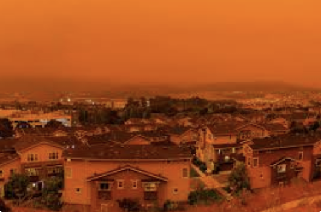
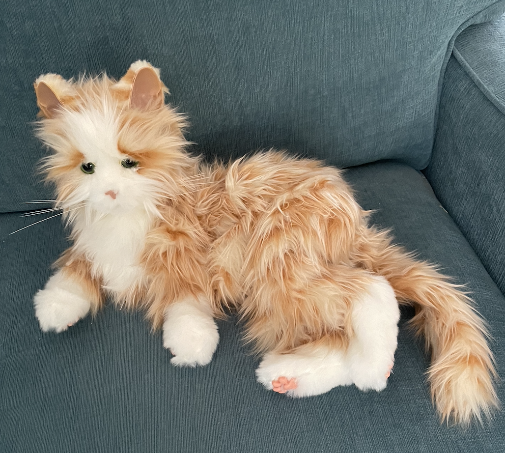

<!-- # ogozalek.github.io -->
<title>ogozalek.github.com</title>
<table>
  <tr>
    <td></td>
    <td><h1>Virginia Ogozalek</h1>
      <h2>MIT xPRO Certificate in Data Engineering 
      May 2023</h2>
      </td>
  </tr>
</table>
<b>Technical Skills:</b> &#x2022; Python &#x2022; SQL &#x2022;  
<h3 text-align:center>Projects</h3>
<table>
  <tr valign="TOP">
    <td><a href="https://github.com/ogozalek/Predict_Housing_Prices">Building a Model to Predict Housing Prices </a> 
       
    This project uses multiple linear regression to predict housing prices based on a dataset for residential houses in Ames, Iowa. 
     
      Tech Stack: Python (pandas, numpy, matplotlib, sklearn, seaborn), CSV file processing </td>
    <td><a href="https://github.com/ogozalek/Covid19_and_Retail_Sales">Exploring Effects of the COVID-19 Lockdowns on Retail Sales </a> 
      
      This project uses ETL to analyze the Monthly Retail Trade Survey (MRTS) dataset for the year 2020. 
       
    Tech Stack: Python (matplotlib, yaml), MySQL, CSV file processing 
      </td>
  </tr>
  </table>
 
  <table>
    <tr valign="TOP">
    <td><a href="https://github.com/ogozalek/Transit_Application">Building a Transit Data Application </a> 
     
      This project uses the API for Boston's MBTA system to display the position of buses on a map on a website. 
     
    Tech Stack: Python (pandas, matplotlib, haversine), MySQL, Flask, HTML, JSON, Docker, Maven Springboot, Debezium, CDC, nano, MongoDB, javamaven 
    </td>
    <td><a href="https://github.com/ogozalek/Netflix_World_Traveler/blob/main/README.md">Netflix World Traveler</a>* 
       
      This project analyzes my Netflix <i>ViewingActivity.csv</i> file to track TV series I've watched from all over the world. 
     
    Tech Stack: Python, CSV file processing, HTML, Flask, machine learning 
    * This is a personal project for educational purposes only.
    </td>
  </tr>
</table>

<table>
    <tr valign="TOP">
    <td><a href="https://github.com/ogozalek/Canadian_Wildfires">Canadian Wildfires Air Quality Sensor Alarm </a> 
     
      This IoT project uses Mosquitto and ThingsBoard with a PurpleAir AQI sensor to sound an alarm and send a message to my iPhone when Canadian wildfires make the air outside my house dangerous to breathe. 
     
    Tech Stack: Mosquitto mqtt, Docker, ThingsBoard, Python, Telegram bots 
    </td>
    <td><a href="https://github.com/ogozalek/Deep_Dream/blob/main/README.md">Deep Neural Networks with Deep Dream</a> 
       
      This project demonstrates how Deep Dream uses deep neural networks to edit an image of my robotic cat, Pumpkin. 
     
    Tech Stack: Deep Dream, Python (NumPy, TensorFlow), machine learning (deep neural networks) 
    </td>
  </tr>
</table>

Creating a Books Web Application 
Creating a Sensemaking Data Pipeline 
Analyzing Live Streaming Data Using ThingsBoard 
* not for final version: <a href="https://github.com/ogozalek/PCDE-Activity-9.1">Repository for Activities 9.1 and 9.2 </a>
